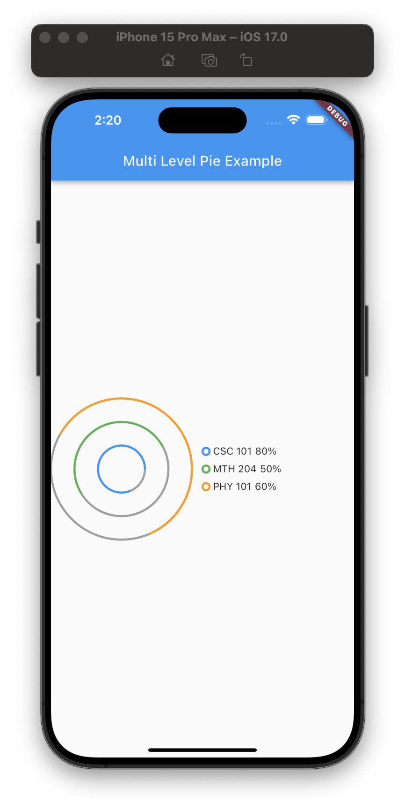
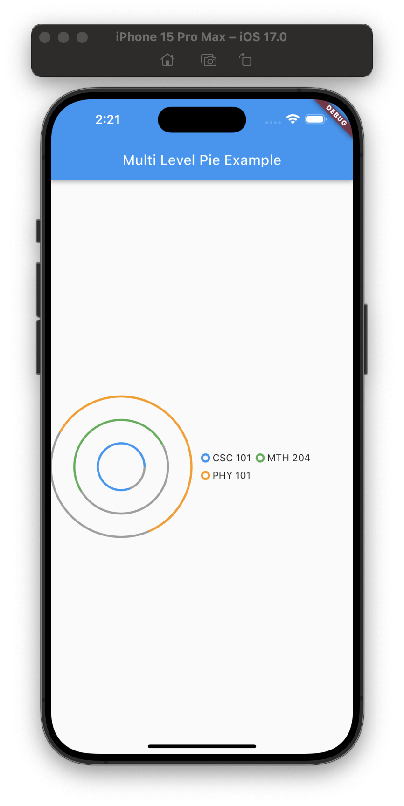
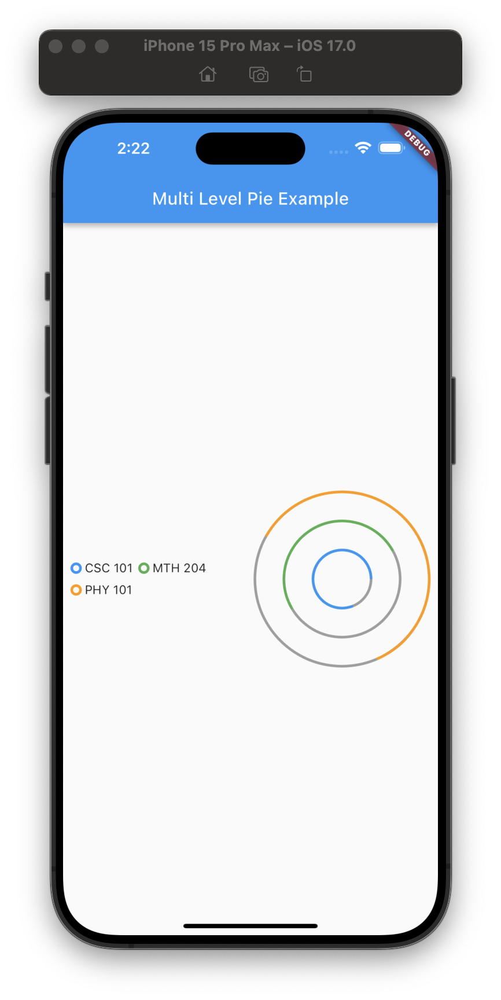

# Multi Level Pie

A Flutter package designed to create visually compelling multi-level pie charts, also known as concentric pie charts or spiral charts. This package is ideal for displaying hierarchical data structures in a concise and visually appealing format. It can be particularly useful for representing data like budget allocations, portfolio distributions, organizational structures, etc., in multiple concentric circles to illustrate relationships and proportions effectively.





## Features

- **Customizable concentric circles**: Allows for the creation of multiple levels within the pie chart, making it easy to visualize nested or hierarchical data.
- **Configurable start angle**: Customize the starting point of your chart to emphasize particular segments.
- **Custom colors**: Personalize the look of your pie chart by specifying the colors of both the background and foreground for each segment.
- **Interactive labels**: Enhance readability with labels and percentage displays for each segment, making it easy for users to understand the data at a glance.

## Getting Started

To start using this package, add `multi_level_pie` as a dependency in your `pubspec.yaml` file:

```yaml
dependencies:
  flutter:
    sdk: flutter
  multi_level_pie: latest_version
```

Ensure you replace latest_version with the most recent version of multi_level_pie.

## Usage

The following example demonstrates how to incorporate a SpiralChart into your Flutter application:

```dart
import 'package:flutter/material.dart';
import 'package:multi_level_pie/multi_level_pie.dart';

void main() => runApp(MyApp());

class MyApp extends StatelessWidget {
  @override
  Widget build(BuildContext context) {
    return MaterialApp(
      home: Scaffold(
        appBar: AppBar(
          title: Text('Multi Level Pie Example'),
        ),
        body: Center(
          child: SpiralChart(
            chartSize: 300,
            spiralInfo: [
              SpiralChartInfo(
                startAngle: 0,
                percentage: 25,
                label: 'Segment A',
                foregroundColor: Colors.blue,
              ),
              SpiralChartInfo(
                startAngle: 90,
                percentage: 50,
                label: 'Segment B',
                foregroundColor: Colors.green,
              ),
              // Add more segments as needed
            ],
          ),
        ),
      ),
    );
  }
}
```

## Additional Information

For more examples and usage, please refer to the /example folder in this package.

We welcome contributions! If you'd like to contribute or have found bugs, please file issues or pull requests on our GitHub repository.

For questions, suggestions, or further assistance, feel free to contact the package maintainers.

## License

This project is licensed under the MIT License - see the [LICENSE](LICENSE) file for details.
